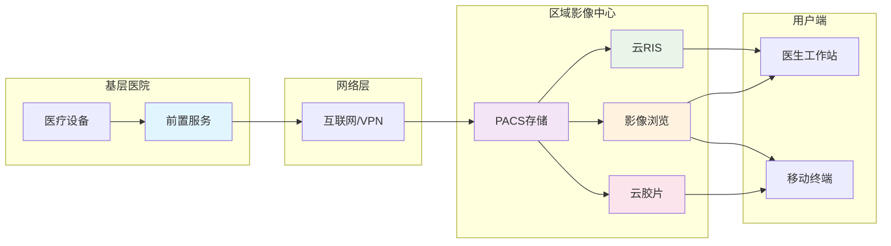

# 云PACS平台

云PACS采用分布式架构设计，实现基层医疗机构与区域影像中心的互联互通，提供统一的影像存储、管理和服务。

# 一、系统架构图

# 二、系统架构

## B/S架构设计
- **浏览器/服务器模式：** 零客户端部署
- **跨平台兼容：** 支持Windows、Linux、MacOS
- **移动端支持：** 响应式设计，适配各种设备
- **统一入口：** Web界面统一管理所有功能

# 三、核心服务

## 前置服务
- **部署：** 基层医院
- **功能：** 设备接入、数据预处理、安全传输
- **特点：** 轻量级、标准DICOM

## PACS存储服务
- **部署：** 区域影像中心
- **功能：** 集中存储、数据管理
- **特点：** 标准DICOM存储、分布式架构、高可用性

## 云RIS服务
- **部署：** 区域影像中心
- **功能：** 检查管理、报告书写
- **特点：** 多机构、权限分级

## 影像浏览服务
- **部署：** 区域影像中心
- **功能：** 影像显示、图像处理
- **特点：** 零客户端、多终端适配

## 云胶片服务
- **部署：** 区域影像中心
- **功能：** 电子胶片、移动端查看
- **特点：** 标准DICOM、安全访问

# 四、技术特点

- **分布式架构：** 高可用性，弹性扩展
- **标准化接口：** 符合DICOM标准
- **云原生设计：** 容器化部署，微服务架构
- **数据安全：** 端到端加密，多重备份

# 五、应用场景

- **区域医联体：** 多院区影像共享
- **分级诊疗：** 基层首诊，上级诊断
- **远程医疗：** 专家远程诊断
- **科研教学：** 病例数据收集
